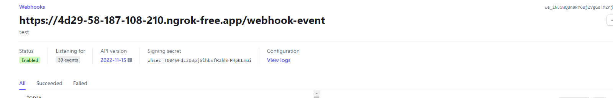

# GOOGLE PAY

## Serve your application over HTTPS

You can Use ngrok

download

https://ngrok.com/

1. Unzip to install

2. Connect your account

```
ngrok config add-authtoken <Your-Authtoken>
```

3. Fire it up

```
ngrok http 8000
```

## Install the stripe-php library:

```
composer require stripe/stripe-php
```

## Create Stripe test account.

1. Register here https://dashboard.stripe.com/register.
1. Get Secret Key and Publishable Key.

## Provide your Stripe API keys in the .env file of your Laravel project.

#### .env

```
STRIPE_KEY=your_stripe_publishable_key
STRIPE_SECRET=your_stripe_secret_key
```

## Create a route in your routes/web.php file to handle the payment process, for

#### routes/web.php

```
<?php
use App\Http\Controllers\StripeController;
use Illuminate\Support\Facades\Route;

Route::get('/googlepay', [StripeController::class, 'googlepay'])->name('googlepay');
Route::post('/payment/intent', [StripeController::class, 'createPaymentIntent'])->name('payment.intent');
```

#### Set up the necessary routes and controllers:

```
php artisan make:controller StripeController
```

#### app/Http/Controllers/StripeController.php

```
<?php
namespace App\Http\Controllers;
use Illuminate\Http\Request;
use Stripe\Stripe;
use Stripe\Customer;
use Stripe\PaymentIntent;

class StripeController extends Controller
{
    public function googlepay()
    {
        return view('googlepay');
    }
    public function createPaymentIntent(Request $request)
    {
        Stripe::setApiKey(env('STRIPE_SECRET'));
        $paymentIntent = PaymentIntent::create([
            'amount' => $request->amount,
            'currency' => 'jpy',
        ]);
        return response()->json(['clientSecret' => $paymentIntent->client_secret]);
    }
}
```

#### Create the view:

##### Use Payment Request Button

About Prerequisites : read hear
https://stripe.com/docs/stripe-js/elements/payment-request-button?client=html#html-js-prerequisites

#### Set up Stripe Element:

##### resources/views/googlepay.blade.php:

```
 <h1 class="mt-4 mb-4">Google pay</h1>
    <div id="payment-request-button">
        <!-- A Stripe Element will be inserted here. -->
    </div>
    <div id="messages" role="alert"></div>
```

#### Add support function:

```
<script>
    // Helper for displaying status messages.
    const addMessage = (message) => {
        const messagesDiv = document.querySelector('#messages');
        messagesDiv.style.display = 'block';
        const messageWithLinks = addDashboardLinks(message);
        messagesDiv.innerHTML += `> ${messageWithLinks}<br>`;
        console.log(`Debug: ${message}`);
    };
    // Adds links for known Stripe objects to the Stripe dashboard.
    const addDashboardLinks = (message) => {
        const piDashboardBase = 'https://dashboard.stripe.com/test/payments';
        return message.replace(
            /(pi_(\S*)\b)/g,
            `<a href="${piDashboardBase}/$1" target="_blank">$1</a>`
        );
    };
</script>

<script src="https://js.stripe.com/v3/"></script>

```

### Use JavaScript to handle the form submission and Google Pay integration.

#### Resources/views/googlepay.blade.php

1. Initialize Stripe

```
 const stripe = Stripe("{{ env('STRIPE_KEY') }}");
```

2. Create a payment request object

```
 var paymentRequest = stripe.paymentRequest({
        country: 'JP',
        currency: 'jpy',
        total: {
            label: 'Demo total',
            amount: paymentAmount,
        },
        requestPayerName: true,
        requestPayerEmail: true,
    });
```

3. Create a PaymentRequestButton element

```
 const elements = stripe.elements();
    const prButton = elements.create('paymentRequestButton', {
        paymentRequest: paymentRequest,
    });

    // Check the availability of the Payment Request API,
    // then mount the PaymentRequestButton
    paymentRequest.canMakePayment().then(function(result) {
        if (result) {
            prButton.mount('#payment-request-button');
        } else {
            document.getElementById('payment-request-button').style.display = 'none';
            addMessage('Google Pay support not found. Check the pre-requisites above and ensure you are testing in a supported browser.');
        }
    });

    paymentRequest.on('paymentmethod', async (e) => {
        // Make a call to the server to create a new
        // payment intent and store its client_secret.
        const {
            error: backendError,
            clientSecret
        } = await fetch(
            "{{ route('payment.intent') }}", {
                method: 'POST',
                headers: {
                    'Content-Type': 'application/json',
                    'X-CSRF-TOKEN': '{{ csrf_token() }}',
                },
                body: JSON.stringify({
                    currency: 'jpy',
                    paymentMethodType: 'card',
                    amount: paymentAmount
                }),
            }
        ).then((r) => r.json());

        if (backendError) {
            addMessage(backendError.message);
            e.complete('fail');
            return;
        }

        addMessage(`Client secret returned.`);

        // Confirm the PaymentIntent without handling potential next actions (yet).
        let {
            error,
            paymentIntent
        } = await stripe.confirmCardPayment(
            clientSecret, {
                payment_method: e.paymentMethod.id,
            }, {
                handleActions: false,
            }
        );

        if (error) {
            addMessage(error.message);

            // Report to the browser that the payment failed, prompting it to
            // re-show the payment interface, or show an error message and close
            // the payment interface.
            e.complete('fail');
            return;
        }
        // Report to the browser that the confirmation was successful, prompting
        // it to close the browser payment method collection interface.
        e.complete('success');

        // Check if the PaymentIntent requires any actions and if so let Stripe.js
        // handle the flow. If using an API version older than "2019-02-11" instead
        // instead check for: `paymentIntent.status === "requires_source_action"`.
        if (paymentIntent.status === 'requires_action') {
            // Let Stripe.js handle the rest of the payment flow.
            let {
                error,
                paymentIntent
            } = await stripe.confirmCardPayment(
                clientSecret
            );
            if (error) {
                // The payment failed -- ask your customer for a new payment method.
                addMessage(error.message);
                return;
            }
            addMessage(`Payment ${paymentIntent.status}: ${paymentIntent.id}`);
        }

        addMessage(`Payment ${paymentIntent.status}: ${paymentIntent.id}`);
    });
```

### Test payment

```
https://<Ngork_url>/goolepay
```

# Bank Transfer

### In your routes/web.php file to handle the payment process.

#### routes/web.php

```
Route::get('/bankpay', [StripeController::class, 'bankpay'])->name('bankpay');
Route::post('/payment/bank-transfer', [StripeController::class, 'createBankPaymentIntent'])->name('payment.bank-transfer');
```

### Set up the necessary routes and controllers:

#### app/Http/Controllers/StripeController.php

```

use Stripe\Stripe;
use Stripe\Customer;
use Stripe\PaymentIntent;


class StripeController extends Controller
{
    public function bankpay()
    {
        return view('bankpay');
    }

    public function createBankPaymentIntent(Request $request)
    {
        $email = $request->email;
        $name = $request->name;
        Stripe::setApiKey(env('STRIPE_SECRET'));
          // Handle the case when the customer already exists
        $existingCustomer = Customer::all(['email' => $email])->data;
        $customer = '';
        if (!$existingCustomer) {
            $customer = Customer::create([
                'email' => $email,
                'name' => $name
            ]);
        } else {
            $customer = $existingCustomer[0];
        }

        // Create a payment intent
        $intent = PaymentIntent::create([
            'amount' => $request->amount,
            'currency' => 'jpy',
            'customer' => $customer->id,
            'payment_method_types' => ['customer_balance'],
            'payment_method_data' => [
                'type' => 'customer_balance',
            ],
            'payment_method_options' => [
                'customer_balance' => [
                    'funding_type' => 'bank_transfer',
                    'bank_transfer' => [
                        'type' => 'jp_bank_transfer',
                    ],
                ],
            ],
        ]);

        // Return the payment intent information to display to the user
        return response()->json([
            'client_secret' => $intent->client_secret,
        ]);
    }
}
```

### Create the view:

#### Create form:

##### resources/views/bankpay.blade.php:

```
<h1>Stripe Bank Transfer Payment</h1>
<form id="payment-form">
    <input type="text" id="customerName" name="customerName" placeholder="customerName" required><br>
    <input type="email" name="email" placeholder="Email" required><br>
    <input type="number" name="amount" placeholder="Amount" required><br>
    <button type="submit">Pay by bank transfer</button>
</form>
```

#### Add support function:

```
<script src="https://js.stripe.com/v3/"></script>

```

### Use JavaScript to handle the form submission.

#### resources/views/bankpay.blade.php

1. Initialize Stripe and handle form submit

```
 <script>
    document.addEventListener('DOMContentLoaded', function() {
        // Initialize Stripe
        var stripe = Stripe("{{ env('STRIPE_KEY') }}");
        var form = document.getElementById('payment-form');
        var errorElement = document.getElementById('cardErrors');

        form.addEventListener('submit', async (event) => {
            event.preventDefault();

            // Create Payment Intent
            const response = await fetch("{{ route('payment.bank-transfer') }}", {
                method: 'POST',
                headers: {
                    'Content-Type': 'application/json',
                    'X-CSRF-TOKEN': '{{ csrf_token() }}',
                },

                body: JSON.stringify({
                    amount: document.getElementById('amount').value,
                    name: document.getElementById('customerName').value,
                    email: document.getElementById('email').value,
                })

            });

            const data = await response.json();
            console.log(data)

            const {
                client_secret
            } = data;

            // Confirm PaymentIntent
            const {
                paymentIntent,
                error
            } = await stripe.confirmPaymentIntent(client_secret)

            if (error) {
                // Handle payment error
                console.error(error.message);
                errorElement.textContent = error.message;
            } else {
                console.log(paymentIntent);
                if (paymentIntent.status === 'requires_action') {
                    const nextAction = paymentIntent.next_action;

                    if (nextAction.type === 'display_bank_transfer_instructions') {
                        // Redirect to hosted instructions URL for bank transfer
                        const hostedInstructionsUrl = nextAction.display_bank_transfer_instructions.hosted_instructions_url;
                        window.location.href = hostedInstructionsUrl;
                    } else if (nextAction.type === 'use_stripe_sdk') {
                        // Handle card action using Stripe.js
                        stripe.handleCardAction(paymentIntent.client_secret)
                            .then(function(result) {
                                if (result.error) {
                                    console.log(result.error.message);
                                } else {
                                    console.log(paymentIntent.id);
                                }
                            });
                    } else {
                        console.log('Unsupported action type:', nextAction.type);
                    }
                } else if (paymentIntent.status === 'succeeded') {
                    console.log('Payment has been successfully completed');
                }
            }
        });

    })
</script>

```

### Test payment

Note: Make sure your bank account has sufficient funds for payment.

```
https://<Ngork_url>/bankpay

```

# Refund

### In your routes/web.php file to handle the payment process.

#### routes/web.php

```
Route::get('/bank-refund', [StripeController::class, 'bankRefund'])->name('bank-refund');
Route::post('/refund/balance', [StripeController::class, 'bankRefundBalance'])->name('bank-refund-balance');
Route::post('/refund/payment', [StripeController::class, 'bankRefundPayment'])->name('bank-refund-payment');
```

### Set up the necessary routes and controllers:

#### app/Http/Controllers/StripeController.php

```

<?php

namespace App\Http\Controllers;

use Illuminate\Http\Request;
use Stripe\Stripe;
use Stripe\PaymentIntent;
use Stripe\Refund;

class StripeController extends Controller
{

    public function bankRefund()
    {
        return view('bank-refund');
    }

    public function bankRefundBalance(Request $request)
    {
        $customerID = 'cus_O2L5wMhDKy2bhr';
        Stripe::setApiKey(env('STRIPE_SECRET'));

        try {
            // get customer’s cash balance
            $customerBalance = Customer::retrieveCashBalance(
                $customerID,
                [
                    'limit' => null,
                    'starting_after' => null,
                    'ending_before' => null,
                ]
            );
            if ($customerBalance) {
                $availableBalance = $customerBalance->available->jpy;

                if ($availableBalance > 0) {
                    // create refund
                    $refund = Refund::create([
                        'amount' => $availableBalance,
                        'currency' => 'jpy',
                        'instructions_email' => 'hienluong1997@gmail.com',
                        'origin' => 'customer_balance',
                        'customer' => $customerID,
                    ]);

                    return response()->json([
                        'success' => true,
                        'message' => 'Refund successful!',
                        'refund' => $refund,
                        'customer_balance' => $availableBalance
                    ]);
                } else {
                    return response()->json([
                        'success' => false,
                        'message' => 'Refund failed. Error: your’s cash balance equal to 0.',
                    ]);
                }
            } else {
                return response()->json([
                    'success' => false,
                    'message' => 'Failed to retrieve customer balance.',
                ]);
            }
        } catch (\Exception $e) {
            return response()->json([
                'success' => false,
                'message' => 'Refund failed. Error: ' . $e->getMessage(),
            ]);
        }
    }

    public function bankRefundPayment(Request $request)
    {
        Stripe::setApiKey(env('STRIPE_SECRET'));
        try {
            // create refund
            $refund = Refund::create([
                'payment_intent' => 'pi_3NHp75Bn8Pm6BjZV3FhEgJva',
                // 'amount' => 666,
                'instructions_email' => 'hienluong1997@gmail.com',
            ]);

            return response()->json([
                'success' => true,
                'message' => 'Refund created successfully!',
                'refund' => $refund,
            ]);
        } catch (\Exception $e) {
            return response()->json([
                'success' => false,
                'message' => 'Failed to create refund. Error: ' . $e->getMessage(),
            ]);
        }
    }
}
```

### Create the view:

##### resources/views/bank-refund.blade.php:

```
<head>
    <title>Refund Form</title>
    <link rel="stylesheet" href="https://stackpath.bootstrapcdn.com/bootstrap/4.5.2/css/bootstrap.min.css">

    {{-- to allow mixed content --}}
    <meta http-equiv="Content-Security-Policy" content="upgrade-insecure-requests">
</head>

// Create form to refund a customer’s cash balance

<section class='ml-4'>
    <h5 class='mt-4 mb-4'>Refund a customer’s cash balance using the API</h5>
    <form method="POST" id="refund-balance-form">
        @csrf
        <button class="btn btn-primary" type="submit">Refund</button>
    </form>
    <p id="refund-balance-form-message" class="text-danger"></p>
</section>


// Create form to refund  payment

<section class='ml-4'>
    <h5 class='mt-4 mb-4'>Refund payment (when the driver refuses) </h5>
    <form method="POST" id="refund-payment-form">
        @csrf
        <button class="btn btn-primary" type="submit">Refund</button>
    </form>
    <p id="refund-payment-form-message" class="text-danger"></p>
</section>


```

### Use JavaScript to handle the form submission.

#### resources/views/bank-refund.blade.php

```

<script>
    document.addEventListener('DOMContentLoaded', function() {
        // Handle  refund balance Form submit
        var refundBalanceForm = document.getElementById('refund-balance-form');
        var refundBalanceMessage = document.getElementById('refund-balance-form-message');
        refundBalanceForm.addEventListener('submit', async (event) => {
            event.preventDefault();

            const response = await fetch("{{ route('bank-refund-balance') }}", {
                method: 'POST',
                headers: {
                    'Content-Type': 'application/json',
                    'X-CSRF-TOKEN': '{{ csrf_token() }}',
                },
                body: JSON.stringify({})
            });

            const data = await response.json();
            console.log(data)
            const {
                success,
                message,
                refund
            } = data;

            console.log(success)
            console.log(message)
            console.log(refund)
            refundBalanceMessage.innerText = message;
        });

        //  Handle  refund payment Form submit
        var refundPaymentForm = document.getElementById('refund-payment-form');
        var refundPaymentMessage = document.getElementById('refund-payment-form-message');
        refundPaymentForm.addEventListener('submit', async (event) => {
            event.preventDefault();

            const response = await fetch("{{ route('bank-refund-payment') }}", {
                method: 'POST',
                headers: {
                    'Content-Type': 'application/json',
                    'X-CSRF-TOKEN': '{{ csrf_token() }}',
                },
                body: JSON.stringify({})
            });

            const data = await response.json();
            console.log(data)
            const {
                success,
                message,
                refund
            } = data;

            console.log(success)
            console.log(message)
            console.log(refund)
            refundPaymentMessage.innerText = message;
        });
    })
</script>

```

### Test refund

in controller file

1. Change instructions_email
2. Change payment_intent that you want to refund
3. Change amount if you want
4. Test bank information

```
account number: 0001234
bank code: 1100
branch code: 000

```

# WEBHOOK

#### Create a route to handle the webhook in the web.php file

```
Route::post('/webhook-event', [StripeController::class, 'handleWebhookEvent'])->name('webhook-event');

```

#### In the StripeController, add the handleWebhookEvent method to handle the webhook from Stripe:

Note: change value of $endpointSecret

You get this value from https://dashboard.stripe.com/test/webhooks/{id}

$endpointSecret is Signing secret


```

use \Stripe\Exception\SignatureVerificationException;
use \Stripe\Webhook;

class StripeController extends Controller
{
   public function handleWebhookEvent(Request $request)
    {
        $payload = $request->getContent();
        $sigHeader = $request->header('Stripe-Signature');
        $endpointSecret = 'whsec_T0B40FdLz03pj5lhbvfRzhhFPHpKLmui';

        try {
            $event = Webhook::constructEvent($payload, $sigHeader, $endpointSecret);
        } catch (SignatureVerificationException $e) {
            // Validation failed, handle error or finish processing
            return response()->json(['error' => $e->getMessage()], 400);
        }

        // Handle webhook notifications
        switch ($event->type) {
            case 'payment_intent.succeeded':
                $paymentIntent = $event->data->object;
                // Then define and call a method to handle the successful

                Log::debug('Webhook received event', [$event->type]);
                Log::debug('Webhook event status',  ['succeeded']);
                // return view('webhook-event', ['paymentIntent' => $paymentIntent, 'even_status' => $even_status]);
                break;
            case 'payment_intent.payment_failed':
                $paymentIntent = $event->data->object;
                // Then define and call a method to handle
                Log::debug('Webhook received event', [$event->type]);
                Log::debug('Webhook event status',  ['payment failed']);
                break;
            case 'refund.created':
                $refund = $event->data->object;
                // Then define and call a method to handle
                Log::debug('Webhook received event', [$event->type]);
                Log::debug('Webhook event status', ['refund created']);
                break;


            case 'refund.updated':
                $refund = $event->data->object;
                // Then define and call a method to handle
                Log::debug('Webhook received event', [$event->type]);
                Log::debug('Webhook event status',  ['refund updated']);
                break;
            case 'customer.created':
                $customer = $event->data->object;
                // Then define and call a method to handle
                Log::debug('Webhook received event', [$event->type]);
                Log::debug('Webhook event status',  ['customer created']);
                break;
                // Handle different events similarly
            default:
                // Unexpected event type
                error_log('Received unknown event type');
        }

        // Trả về HTTP response với mã status 200
        return response()->json(['success' => true], 200);
    }
    }


```

#### Remove CSRF token authentication for Stripe's webhook

```
class VerifyCsrfToken extends Middleware
{
    /**
     * The URIs that should be excluded from CSRF verification.
     *
     * @var array
     */
    protected $except = [
        'webhook-event'
    ];
}
```

##### Go to the Webhook settings on the Stripe dashboard and configure the webhook URL to point to the route you created (/webhook-event).

example:

```
https://4d29-58-187-108-210.ngrok-free.app/webhook-event

```

#### Create payment and watch change in storage/logs/laravel.log

# PAYOUT

## Use Stripe connect

Prerequisites

https://stripe.com/docs/connect/add-and-pay-out-guide#with-code-prerequisites

## create connected account in stripe dashboard

https://dashboard.stripe.com/test/connect/accounts/overview

verify account to status 'completed'.

## Create external account (add bank account for connected account)

#### app/Http/Controllers/StripeController.php

```
    public function createBank()
    {
        return view('create-bank');
    }
    public function storeExternalAccount(Request $request)
    {

        $account_holder_name = $request->input('account_holder_name');
        $account_number = $request->input('account_number');
        $routing_number = $request->input('routing_number');

        Stripe::setApiKey(env('STRIPE_SECRET'));
        try {
            $external_account = Account::createExternalAccount(
                'acct_1NNWEiB4CTSrzQns', // ID của connected account
                [
                    'external_account' => [
                        'object' => 'bank_account',
                        'country' => 'JP',
                        'currency' => 'jpy',
                        'account_number' =>  $account_number,
                        'routing_number' => $routing_number,
                        'account_holder_name' =>  $account_holder_name,
                        'account_holder_type' => 'individual',
                    ],
                ]
            );
            return view('create-bank')->with('external_account', $external_account);
        } catch (\Exception $e) {
            return view('create-bank')->with('error', 'Failed to create external accounts . Error: ' . $e->getMessage());
        }
    }

```

#### resources/views/create-bank.blade.php

```
<head>
    <title>Create bank</title>
    <link rel="stylesheet" href="https://stackpath.bootstrapcdn.com/bootstrap/4.5.2/css/bootstrap.min.css">
    {{-- to allow mixed content --}}
    <meta http-equiv="Content-Security-Policy" content="upgrade-insecure-requests">
</head>

<h1>Create bank</h1>

<body class="m-4">
    <form action="{{ route('store-bank') }}" method="POST">
        @csrf
        <div class="form-group">
            <label for="account_holder_name">Account Holder Name</label>
            <input type="text" name="account_holder_name" id="account_holder_name" class="form-control" required>
        </div>

        <div class="form-group">
            <label for="account_number">Account Number</label>
            <input type="text" name="account_number" id="account_number" class="form-control" required>
        </div>

        <div class="form-group">
            <label for="bank_name">Routing Number</label>
            <input type="text" name="routing_number" id="routing_number" class="form-control" required>
        </div>

        <button type="submit" class="btn btn-primary">Add Bank Account</button>
        <a href="{{ route('list-bank') }}" class="btn btn-primary ">Show list bank</a>
    </form>

    @if(isset($external_account))
    <h5 class="alert alert-success"> Add bank account successfull with id :{{$external_account->id}}</h5>
    @endif

    @if(isset($error))
    <h5 class="alert alert-danger"> {{$error}}</h5>
    @endif
</body>

```

## Show list bank account to payout

#### app/Http/Controllers/StripeController.php

```
   public function getExternalAccounts(Request $request)
    {
        try {
            Stripe::setApiKey(env('STRIPE_SECRET'));
            $externalAccounts = Account::allExternalAccounts(
                'acct_1NNWEiB4CTSrzQns', // ID of connected account
                [
                    'object' => 'bank_account',
                    // 'limit' => '',
                ]
            );

            return view('list-bank')->with('account_list', $externalAccounts);
        } catch (\Exception $e) {
            return response()->json([
                'success' => false,
                'message' => 'Failed to get list external accounts . Error: ' . $e->getMessage(),
            ]);
        }
    }

```

#### resources/views/list-bank.blade.php

```
<head>
    <title>List Bank</title>
    <link rel="stylesheet" href="https://stackpath.bootstrapcdn.com/bootstrap/4.5.2/css/bootstrap.min.css">
    {{-- to allow mixed content --}}
    <meta http-equiv="Content-Security-Policy" content="upgrade-insecure-requests">
</head>


<body class="mt-4 ml-4">
    @foreach ($account_list as $item)
    <form id="payout" action="{{ route('createPayout') }}" method="POST">
        @csrf
        <input type="hidden" name="bank_id" value="{{ $item->id}}">
        <span>{{ $item->account_holder_name}} - bank number last : {{ $item->last4}}</span>
        <button type="submit" class="btn-primary mt-3">payout</button>
    </form>
    @endforeach

    <a href="{{ route('create-bank') }}" class="btn btn-primary mt-3">Add bank</a>
</body>
```

## Create Payout

#### app/Http/Controllers/StripeController.php

```
   public function createPayout(Request $request)
    {
        $destination = $request->input('bank_id');
        Stripe::setApiKey(env('STRIPE_SECRET'));
        try {
            $payout = Payout::create([
                'amount' => 131,
                'currency' => 'jpy',
                'destination' => $destination, // ID of bank
                'description' => 'STRIPE PAYOUT for driver'
            ], ['stripe_account' => 'acct_1NNWEiB4CTSrzQns']);

            return view('payout-result')->with('payout', $payout);
        } catch (\Exception $e) {
            return view('payout-result')->with('error', 'Failed to create payout. Error: ' . $e->getMessage());
        }
    }


 public function payoutResult()
    {
        return view('payout-result');
    }

```

#### resources/views/payout-result.blade.php

```

<head>
    <title>payout-result</title>
    <link rel="stylesheet" href="https://stackpath.bootstrapcdn.com/bootstrap/4.5.2/css/bootstrap.min.css">
    {{-- to allow mixed content --}}
    <meta http-equiv="Content-Security-Policy" content="upgrade-insecure-requests">
</head>

<body class="m-4">
    <h1>payout-result</h1>
    @if(isset($payout))
    <h5 class="alert alert-success"> Create payout successfull with id :{{$payout->id}}</h5>
    @endif

    @if(isset($error))
    <h5 class="alert alert-danger"> {{$error}}</h5>
    @endif
    <a href="{{ route('list-bank') }}" class="btn btn-primary ">Back to list bank</a>
    <a href="{{ route('list-payout') }}" class="btn btn-primary ">Back to list payout</a>
</body>

```

## Check payout status

#### app/Http/Controllers/StripeController.php

```
      public function getListPayout(Request $request)
    {
        $destination = $request->input('bank_id');
        Stripe::setApiKey(env('STRIPE_SECRET'));
        try {
            $payout_list = Payout::all([
                'limit' => 100,
            ], ['stripe_account' => 'acct_1NNWEiB4CTSrzQns']);

            return view('list-payout')->with('payout_list', $payout_list);
        } catch (\Exception $e) {
            return response()->json([
                'success' => false,
                'message' => 'Failed to get payout list . Error: ' . $e->getMessage(),
            ]);
        }
    }

```

#### resources/views/payout-list.blade.php

```
<head>
    <title>List Payout</title>
    <link rel="stylesheet" href="https://stackpath.bootstrapcdn.com/bootstrap/4.5.2/css/bootstrap.min.css">
    {{-- to allow mixed content --}}
    <meta http-equiv="Content-Security-Policy" content="upgrade-insecure-requests">
</head>


<body class="mt-4 ml-4">
    @foreach ($payout_list as $payout)

    <div>
        <p>{{ $payout->id}}</p> <span>{{ $payout->description}}</span>
        <span class="btn-primary mt-3">{{ $payout->status}}</span>
        <span class="btn-primary  alert-danger mt-3">{{ $payout->failure_message}}</span>
    </div>
    @endforeach
</body>
```

## Test Payout

#### Add real bank accout for stripe admin

https://dashboard.stripe.com/settings/payouts

#### Transfer Balances from admin account to connected account

https://dashboard.stripe.com/test/connect/transfers

#### Use list test account provides form stripe to add bank account

https://stripe.com/docs/connect/testing#payouts

#### Watch payout log

note: change your connected account in bellow link 'acct_1NNWEiB4CTSrzQns'

https://dashboard.stripe.com/test/connect/accounts/acct_1NNWEiB4CTSrzQns/activity
